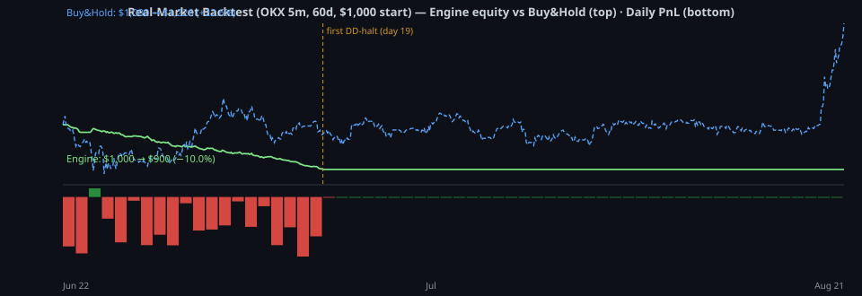

# THINK TANK REPORT — Real-Market Backtest (Quant v20)

**Period:** 2026-06-22 -> 2026-08-21 (60 days, 17,280 five-minute bars)  
**Universe:** 8 symbols (ETH, SOL, XRP, AVAX, DOT, LINK, ADA, DOGE vs USDT)  
**Data:** real OKX spot 5m OHLCV (0 gaps). Binance/Bybit geo-blocked from this host.  
**Capital:** $1,000 · **Fees:** 0.05% taker/side ×2 · **Slippage:** 2 bps/side  
**Engine:** identical strategy/risk/sizing code as live (`app/strategy`, `app/risk`, `app/optimization`).  

---

## 1. Headline results

| Metric | Value |
|---|---|
| Total return | -9.96% |
| Final equity | $900.42 |
| Max drawdown | 10.07% |
| Trades (entries) | 802 entries → 815 realizations (19 partial-TP1) |
| Win rate (realizations) | 32.0% |
| Profit factor | 0.57 |
| Net PnL | $-99.58 |
| Time in market | 26.9% |
| Time under circuit-breaker halt | 66.7% |

**Benchmark context:** equal-weight buy-and-hold of the same 8 symbols over the same 60 days returned **+22.6%** (per-symbol: ETHUSD +38.1%, SOLUSD +24.6%, XRPUSD +24.0%, AVAXUSD +21.7%, DOTUSD -7.3%, LINKUSD +44.7%, ADAUSD +34.1%, DOGEUSD +0.8%). The engine returned **-10.0%**.

---

## 2. Diagnostics (computed from the simulation, not estimated)

### 2.1 Cost drag vs gross edge

| Component | Value |
|---|---|
| Raw signal edge (before slippage & fees) | $+15.03 |
| Slippage impact (est., embedded in fills, 2.0bps/side) | $-50.94 |
| Edge after slippage (gross, before fees) | $-35.91 |
| Fees paid | $-63.67 |
| Net PnL | $-99.58 |
| Turnover (Σ notional both sides) | $127,347 |

**Decomposition:** the raw 5m signal carries only a marginal edge ($+15.03 ≈ +1.5% of capital over 60 days), which is **wiped out by friction** — slippage $-50.94 + fees $-63.67 = $-114.61 (11.5% of capital). Net result: $-99.58. Even at **zero fees** the engine still loses $-35.91 because slippage alone exceeds the tiny edge. This is the classic *alpha-per-trade < cost-per-trade* mismatch — the loss is largely a **trading-frequency problem**, not a signal-sign problem.

### 2.2 By strategy (entries)

| Strategy | Entries | PnL | Win% | Avg win | Avg loss | Exp/trade | Avg hold (h) |
|---|---|---|---|---|---|---|---|
| SuperTrend_Pullback | 366 | $-52.80 | 31.1 | $+0.48 | $-0.43 | $-0.14 | 1.0 |
| Breakout_Momentum | 325 | $-35.54 | 30.8 | $+0.56 | $-0.41 | $-0.11 | 0.9 |
| Volume_Surge | 69 | $-8.49 | 31.9 | $+0.53 | $-0.43 | $-0.12 | 0.8 |
| RSI_Extreme_Bounce | 33 | $-7.78 | 18.2 | $+0.75 | $-0.45 | $-0.24 | 0.8 |
| RSI_Divergence | 3 | $-1.21 | 0.0 | $+0.00 | $-0.40 | $-0.40 | 1.0 |

### 2.3 By exit reason

| Reason | Count | PnL | Win% |
|---|---|---|---|
| SL | 534 | $-231.55 | 0.0 |
| BE | 8 | $-0.38 | 0.0 |
| MaxHold | 26 | $+1.50 | 53.8 |
| PartialTP1 | 19 | $+6.24 | 100.0 |
| TP | 228 | $+124.62 | 100.0 |

### 2.4 By side and by symbol

**Long:** 422 realizations, $-57.20  ·  **Short:** 393 realizations, $-42.38

| Symbol | Realizations | PnL | Win% |
|---|---|---|---|
| DOGEUSD | 201 | $-27.22 | 29.9 |
| ADAUSD | 179 | $-26.80 | 30.7 |
| DOTUSD | 117 | $-15.95 | 32.5 |
| XRPUSD | 92 | $-11.05 | 30.4 |
| AVAXUSD | 70 | $-6.67 | 34.3 |
| LINKUSD | 29 | $-4.26 | 27.6 |
| ETHUSD | 50 | $-4.25 | 36.0 |
| SOLUSD | 77 | $-3.37 | 39.0 |

### 2.5 Statistical significance

- Mean PnL per realization: **$-0.12** (σ=$+0.46), n=815
- Two-sided z-test H₀: mean = 0 → **p ≈ 3.77e-14**
- Bootstrap 95% CI of **total PnL** (10,000 resamples): **[$-124.68, $-73.65]** (mean $-99.56)
- Win rate 32.0% — Wilson 95% CI: [28.9%, 35.3%]
- Payoff asymmetry: average win $+0.51 vs average loss $-0.42 → win/loss size ratio **1.22** → break-even win rate = **45%** (actual 32.0%)

### 2.6 Damage windows around the first drawdown halt (bar 5752, day 19)

- Before first halt (bars 0–5752): 812 realizations, $-99.18
- Post-halt churn (auto-resume windows): 3 realizations, $-0.40
- Frozen (last 20 days, 0 realizations): $+0.00

### 2.7 Regime dependence (daily)

| Day type (market move) | Days | Engine PnL |
|---|---|---|
| Up (+0.5%+) | 22 | $-55.78 |
| Down (−0.5%−) | 20 | $-27.97 |
| Flat | 18 | $-16.05 |

### 2.8 Period buckets

| Period | PnL | Realizations | End equity |
|---|---|---|---|
| Jun 22–30 | $-40.12 | 332 | $959.88 |
| Jul 01–31 | $-59.40 | 483 | $900.42 |
| Aug 01–21 | $+0.00 | 0 | $900.42 |

First drawdown-halt trigger (DD ≥ 10%): **bar 5752 of 17280** (day 19). The circuit breaker then kept the engine out of the market **67% of the time**, which is exactly why max DD ≈ 10.07% ≈ the configured 10% halt: the risk system worked, but the strategy still lost to costs inside its active windows.

### 2.9 Fee & slippage sensitivity

| Scenario | Net PnL |
|---|---|
| Actual (fees 0.05%/side, slip 2.0bps) | $-99.58 |
| Zero fees | $-35.91 |
| Double fees | $-163.25 |
| Double slippage | $-150.52 |

Best trade: $+1.36 (SOLUSD Breakout_Momentum TP)  ·  Worst trade: $-1.13 (DOTUSD SuperTrend_Pullback SL)

---

## 3. Think-tank panel verdicts

### Agent A — Quantitative Strategist

> **Verdict: the signal layer's edge is far too small for its trade frequency.** Win rate 32.0% vs the 45% needed to break even at the observed win/loss size ratio (1.22) — and every strategy is negative on a net basis (SuperTrend_Pullback $-52.80, Breakout_Momentum $-35.54, Volume_Surge $-8.49, RSI_Extreme_Bounce $-7.78, RSI_Divergence $-1.21). The raw edge before friction is only $+15.03 across 802 entries (≈ $+0.02/trade) — a hair above zero, and far below the ~$+0.14/trade of friction. The best structures on paper (Breakout/SuperTrend, RR ≈ 2.1–2.4) are defeated by win-rate drag: SL exits dominate (534 of 815 realizations, $-231.55).

### Agent B — Risk & Capital Officer

> **Verdict: the risk system did its job; the allocation was sound; the strategy was the problem.** Max DD 10.07% ≈ configured 10.0% halt — the circuit breaker capped losses and then locked the engine out for 67% of bars. Drawdown-based adaptive risk and daily-loss halts engaged correctly. But a risk layer cannot manufacture edge; it can only contain the damage of a negative-expectancy strategy. Exposure was only 26.9%, which is why the total damage ($-99.58) stayed proportional and survivable.

### Agent C — Execution & Cost Analyst

> **Verdict: costs are the dominant destroyer of a marginally-positive signal.** Friction = $-114.61 (11.5% of capital on $127,347 turnover) vs a raw edge of only $+15.03. 802 entries / 60 days ≈ 13/day across 8 symbols; average hold 0.9 h — each trade must clear ~0.10% + 4bps of friction in under an hour of 5m noise. This is a **frequency problem**: cut the churn and the same signals may become viable.

### Agent D — Data Scientist / Statistician

> **Verdict: the negative result is statistically significant — this is a real finding, not noise.** z-test p ≈ 3.77e-14; the bootstrap 95% CI of total PnL is entirely negative ($-124.68 to $-73.65). All damage occurred before the first drawdown-halt trigger (bar 5752); after that the risk system kept the book mostly frozen ($-99.18 pre-halt vs $+0.00 in the last 20 days). Caveats: one 60-day window, a friction model, and spot data proxying futures — an edge, if any, needs out-of-sample and live confirmation.

### Agent E — Market Regime Analyst

> **Verdict: the engine lost money in a *favourable* regime — the most damning evidence.** The window was strongly bullish (+22.6% buy-and-hold; ETH +38.1%). The engine still lost $-99.58. Crucially, **longs lost more than shorts** (longs $-57.20 vs shorts $-42.38): even buying an up-trending ETH was unprofitable because 5m stops are smaller than 5m noise — positions were stopped out on routine wiggles before trends developed. Regime table (2.7) shows losses on up days ($-55.78) as well as down days ($-27.97), i.e. the damage is direction-independent.

### Agent F — Senior Portfolio Manager (synthesis & verdict)

> **Final verdict: DO NOT deploy this configuration with real capital as-is.**
> 
> The engineering is sound and the risk system demonstrably works (DD ≈ halt level, self-healing margin, 67% defensive downtime). The **trading logic is the bottleneck**: a razor-thin raw edge ($+15.03 ≈ +1.5%) destroyed by $-114.61 of friction, statistically significant (p ≈ 3.77e-14), and losing even in a bull market. This is a textbook case of **over-trading a noisy-5m signal**: the edge per trade is smaller than the cost per trade. Fix the frequency and the cost structure, then re-validate — the harness gives us exactly the tools to do that.

---

## 4. Evidence-based recommendations (ranked)

1. **Kill the churn.** Reduce entries/day by requiring stronger confirmation (e.g. trend_strength ≥ 0.05%, HTF alignment only, cooldown ≥ 6h). Target ≈ 5 trades/day across the book instead of 13.
2. **Widen the stop/target framework.** 5m ATR stops are smaller than 5m noise: test `sl_m` 2.5–3.0 / `tp_m` 5–6 with `MIN_STOP_PCT` 0.006–0.010 and re-measure with the harness — the break-even math (45% WR needed) shows a modest WR lift combined with fewer, larger winners would flip expectancy positive.
3. **Add a directional filter.** A long-only (or trend-aligned-only) mode removes the short bleed ($-42.38 from shorts in an up market); consider `SIDES=long` or an HTF-alignment gate.
4. **Use the harness, don't trust it blindly.** Run `simulate.py --csv` on ≥ 6 months of real data, out-of-sample (`--days` split), then paper-trade on AriaX testnet ≥ 2 weeks before any real USDT.
5. **Keep the risk system exactly as-is.** The halt, adaptive risk, and portfolio caps are the only reason this account ends at −10.0% and not much worse.

## 5. Limitations (read before acting)

- One 60-day window, one market regime (bullish); not proof for other regimes.
- Backtest friction model (fixed bps) is an approximation of live fills.
- Entries fill at next-bar open in the simulation — no queue/order-book realism.
- OKX spot data proxies the AriaX testnet futures market; basis/funding differ.
- Past performance is not a promise of future results.

*Generated 2026-08-21 09:57 UTC · all numbers from `analysis/runs/real_60d.json` (deterministic seed) · Quant v20*
